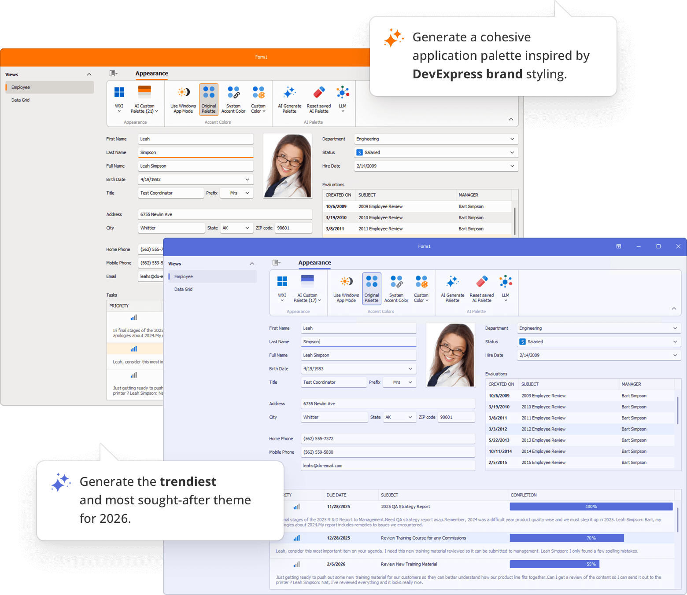
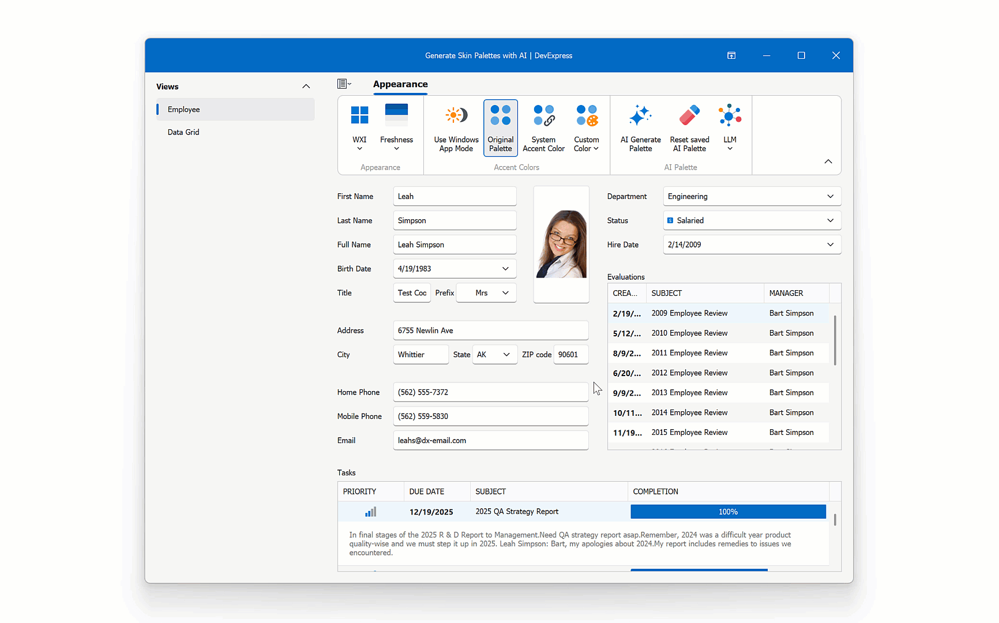

<!-- default badges list -->

[](https://supportcenter.devexpress.com/ticket/details/T1315981)
[](https://docs.devexpress.com/GeneralInformation/403183)
[](#does-this-example-address-your-development-requirementsobjectives)
<!-- default badges end -->
# Generate WinForms SVG Skin Palettes with AI

This example leverages AI to create custom SVG skin palettes to personalize an application's appearance on the fly. Users can generate, save, and delete AI-created palettes between application sessions. Additional features include:

- Refine palettes using conversation history.
- Preview and save palettes with a single click.
- Store palettes in JSON format in application settings.
- Swap LLMs (`gpt-4.1`, `gpt-4o-mini`, `gpt-5-mini`).



## Prerequisites

- .NET 8+ SDK
- Visual Studio 2022, JetBrains Rider

## Get Started

- Build the solution.
- Start the `DevExpress.AI.WinForms.AIGeneratePalette.Demo` project to run the example.
- Click the **AI Generate Palette** button in the Ribbon UI to invoke the AI-powered palette editor.
- Generate a color palette based on your preferences and click **Save**.



> [!Tip]
> **Prompt Examples**
> ```
> - Generate a warm autumn palette
> - Make a high-contrast accessibility-friendly palette
> - Create a modern flat pastel palette
> ```
 
## Project Structure

```
DevExpress.AI.WinForms.AIGeneratePalette
│
├── GeneratePaletteExtension
│   ├── GeneratePaletteExtension.cs         # Core AI palette generation logic
│   ├── GeneratePaletteResponseHelpers.cs   # Helpers for parsing AI responses
│   └── GeneratePaletteInstruction.md       # Contains AI instructions for palette generation
│
├── Persistence
│   └── AIPaletteRepository.cs              # Stores and retrieves palettes
│
├── UI
│   ├── GeneratePaletteDialog.cs            # WinForms dialog for palette generation
│   ├── GeneratePaletteHistoryItem.cs       # Represents a saved palette entry
│   └── GeneratePaletteUIViewModel.cs       # ViewModel that manages UI state
│
DevExpress.AI.WinForms.AIGeneratePalette.Demo
│
├── AI
│   └── ChatClientFactory.cs                # Creates AI chat clients
│
├── Infrastructure
│   └── DataService.cs                      # Data access service
│
├── Logging
│   └── SimpleFileLogger.cs                 # Logs events to a JSON file
│
├── Model
│   ├── Customer.cs                         # Customer entity
│   ├── EmployeeDataHelper.cs               
│   ├── Order.cs                            # Order entity
│   └── Product.cs                          # Product entity
│
├── Views
│   ├── DataGridView.cs                     # Displays data in a DevExpress WinForms Grid
│   └── EmployeeView.cs                     # Employee-specific UI view
│
├── AccordionShellForm.cs                   # Main demo form
└── Program.cs                              # Application entry point
```

## Register AI Service

This example uses rate-limited AI services. You may experience performance-related delays. To remove artificial limits, connect to your own AI service or model.

Open [ChatClientFactory.cs](./CS/DevExpress.AI.WinForms.AIGeneratePalette.Demo/AI/ChatClientFactory.cs) and provide your credentials:

```csharp
static Uri AzureOpenAIEndpoint {
    get {
        string azureOpenAIEndpoint = GetEnvironmentVariable("AZURE_OPENAI_ENDPOINT", IsDeveloperMode);
        if(string.IsNullOrEmpty(azureOpenAIEndpoint))
            azureOpenAIEndpoint = "https://public-api.devexpress.com/demo-openai"; // DevExpress proxy-server
        return new Uri(azureOpenAIEndpoint);
    }
}
static System.ClientModel.ApiKeyCredential AzureOpenAIKey {
    get {
        string azureOpenAIKey = GetEnvironmentVariable("AZURE_OPENAI_API_KEY", IsDeveloperMode);
        if(string.IsNullOrEmpty(azureOpenAIKey))
            azureOpenAIKey = "DEMO"; // Demo key
        return new System.ClientModel.ApiKeyCredential(azureOpenAIKey);
    }
}
```

> [!Note]
> We use the following versions of the `Microsoft.Extensions.AI.*` and `Azure.AI.*` libraries in our source code:
>
> - `Azure.AI.OpenAI`: **2.2.0-beta.5**
> - `Microsoft.Extensions.AI`: **9.7.1**
> - `Microsoft.Extensions.AI.OpenAI`: **9.7.1-preview.1.25365.4**
>
> We do not guarantee compatibility or correct operation with higher versions.

## Implementation Details

### Open the Palette Editor

```csharp
void aiGeneratePaletteButton_ItemClick(object sender, ItemClickEventArgs e) {
    if(!UserLookAndFeel.Default.IsSvgSkin()) {
        XtraMessageBox.Show(this, "The current skin does not support SVG palettes. Please switch to an SVG skin and try again.", "SVG Skin Required", MessageBoxButtons.OK, MessageBoxIcon.Warning);
        return;
    }
    else {
        using(GeneratePaletteDialog dialog = new GeneratePaletteDialog()) {
            dialog.StartPosition = FormStartPosition.CenterParent;
            dialog.ShowDialog(this);
        }
    }
}
```

### Save Custom Palettes on Exit

```csharp
void AccordionShellForm_FormClosed(object sender, FormClosedEventArgs e) {
    string saveToJson = AIPaletteRepository.SaveToJson();

    Properties.Settings.Default.CustomPalettes_JSON = saveToJson;
    Properties.Settings.Default.Save();
}
```

### Load Custom Palettes on Startup

```csharp
static void Main() {
    // ...
    AIPaletteRepository.LoadAIPalettes(Properties.Settings.Default.CustomPalettes_JSON);
    // ...
    var host = CreateHostBuilder().Build();
    Application.Run(new AccordionShellForm(host.Services));
}
```

### Swap AI Model (LLM)

```csharp
void gptCheckItem_CheckedChanged(object sender, ItemClickEventArgs e) {
    IChatClient chatClient = ChatClientFactory.Create((string)e.Item.Tag);
    var defaultContainer = AIExtensionsContainerDesktop.Default;
    defaultContainer.UnregisterChatClient();
    defaultContainer.RegisterChatClient(chatClient);
}
```

### AI Instructions for Palette Generation

[GeneratePaletteInstruction.md](./CS/DevExpress.AI.WinForms.AIGeneratePalette/GeneratePaletteExtension/GeneratePaletteInstruction.md) contains AI instructions used to generate color palettes for DevExpress WinForms SVG skins.

## Files to Review

**DevExpress.AI.WinForms.AIGeneratePalette**

- [AIPaletteRepository.cs](./CS/DevExpress.AI.WinForms.AIGeneratePalette/Persistence/AIPaletteRepository.cs)
- [GeneratePaletteExtension.cs](./CS/DevExpress.AI.WinForms.AIGeneratePalette/GeneratePaletteExtension/GeneratePaletteExtension.cs)
- [GeneratePaletteResponseHelpers.cs](./CS/DevExpress.AI.WinForms.AIGeneratePalette/GeneratePaletteExtension/GeneratePaletteResponseHelpers.cs)
- [GeneratePaletteDialog.cs](./CS/DevExpress.AI.WinForms.AIGeneratePalette/UI/GeneratePaletteDialog.cs)

**DevExpress.AI.WinForms.AIGeneratePalette.Demo**

- [ChatClientFactory.cs](./CS/DevExpress.AI.WinForms.AIGeneratePalette.Demo/AI/ChatClientFactory.cs)
- [AccordionShellForm.cs](./CS/DevExpress.AI.WinForms.AIGeneratePalette.Demo/AccordionShellForm.cs)
- [Program.cs](./CS/DevExpress.AI.WinForms.AIGeneratePalette.Demo/Program.cs)

## Documentation

- [Register AI Clients in WinForms Apps](https://docs.devexpress.com/WindowsForms/405151/ai-powered-extensions?v=25.2#register-ai-clients)
- [WinForms AI Chat Control](https://docs.devexpress.com/WindowsForms/405218/ai-powered-extensions/ai-chat-control?v=25.2)
- [Skin Palettes](https://docs.devexpress.com/WindowsForms/2399/build-an-application/skins?v=25.2&p=netframework#skin-palettes)
<!-- feedback -->
## Does this example address your development requirements/objectives?

[](https://www.devexpress.com/support/examples/survey.xml?utm_source=github&utm_campaign=winforms-generate-skin-palettes-with-ai&~~~was_helpful=yes) [](https://www.devexpress.com/support/examples/survey.xml?utm_source=github&utm_campaign=winforms-generate-skin-palettes-with-ai&~~~was_helpful=no)

(you will be redirected to DevExpress.com to submit your response)
<!-- feedback end -->
